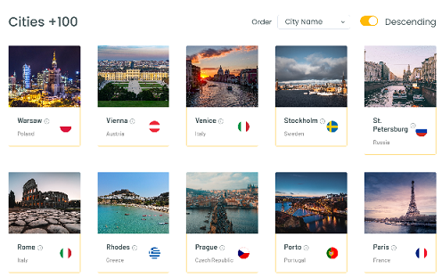
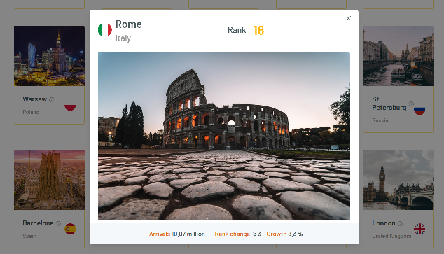
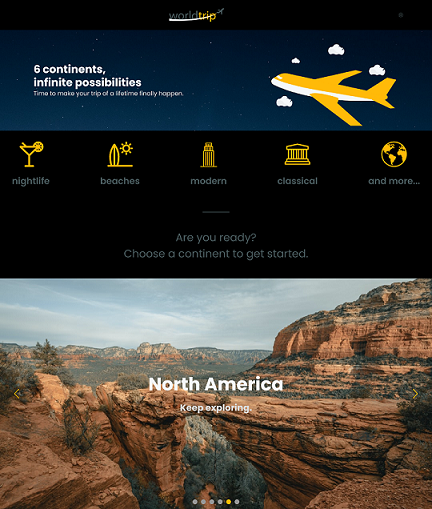
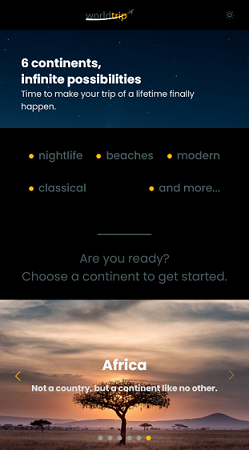
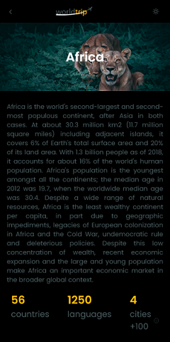
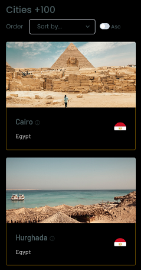

# World Trip


## Original Figma layout

https://www.figma.com/file/8QAkMs3BddatXn2fFseyu4/Desafio-1-M%C3%B3dulo-4-ReactJS/duplicate

## Features

- Continent selection
- City listing, according to the [100 most popular city destinations in the world](https://www.visualcapitalist.com/the-100-most-popular-city-destinations/)
  - Customization of the order by which the cities are listed\
    
  - Exhibition of the city's detailed information\
    
- Dark mode\
  
- Responsive design\
  
  
  

## Installation (Development mode)

### 1. Download or clone the repository

### 2. Open the project's home folder

### 3. Start the JSON Server for the database

```bash
yarn db
```

or

```bash
npm run db
```

### 4. Start the application

```bash
yarn dev
```

or

```bash
npm run dev
```

## Technologies

- [Chakra UI](https://chakra-ui.com)
- [JSON Server](https://github.com/typicode/json-server)
- [Next.js](https://nextjs.org)
- [React Country Flag](https://github.com/danalloway/react-country-flag)
- [SASS](https://sass-lang.com)
- [Swiper React Components](https://swiperjs.com/react)
- [Typescript](https://www.typescriptlang.org)

## Images

- [Unsplash](https://unsplash.com/)

## Implementation and extra features

[Artur Teixeira](https://github.com/anoura71), based on an activity proposed by the ReactJS trail of the Ignite bootcamp by [Rocketseat](https://rocketseat.com.br/ignite).
